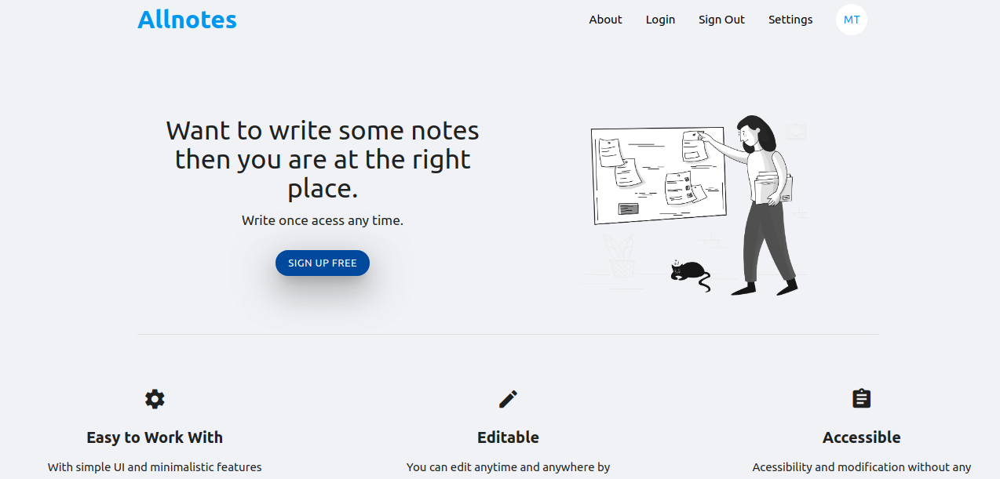
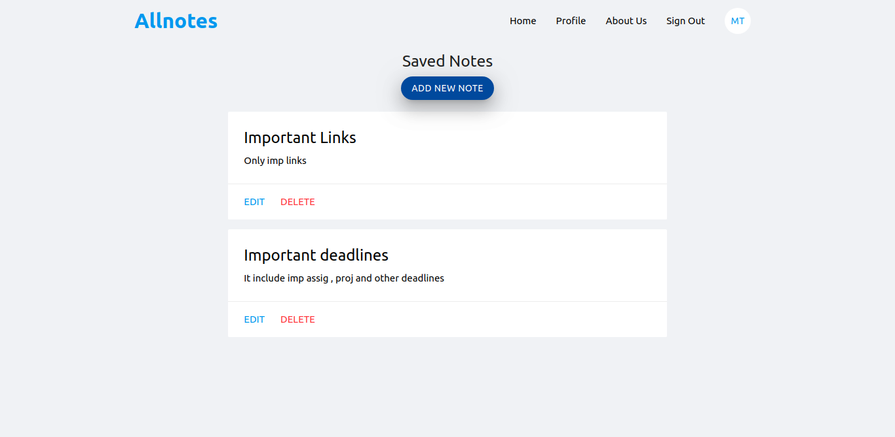

# Allnotes
In this project we try to implement few features of Evernote.

<a href="https://allnotes-d605d.web.app/">Visit Allnotes website</a>

# Features
<ul>
    <li>New User Signup</li>
    <li>User Login</li>
    <li>Create Note</li>
    <li>Delete Note</li>
    <li>Edit Note</li>
    <li>
    Modern Editor
    <ol>
    <li>Customize size of title </li>
    <li>Embed Video from link</li>
    <li>Write Code in special code block</li>
    <li>Marker</li>
    <li>Quote Support</li>
    and many more ..
    </ol>
    </li>
</ul>

# Frontend

We have used <b>ReactJS</b> for the frontend. Each components used in the project can be found at <b>src/components/</b> folder. For Editor we have used EditorJS third party package.

# Backend

We have used Firebase cloud firestore as our database. Firesbase authentication is used for authentication.

# Deployment

This project is deployed over firebase hosting. 

# Dependencies

<ol>
<li>Node js >=8.10 </li>
<li>Npm >=5.6 </li>
</ol>

# Run locally
<ol>
<li>Clone the project into your local repository.</li>
<li>Open terminal and go to your project folder</li>
<li>Type npm install ( To install all the dependencies )</li>
<li>Create a firebase project</li>
<li>Copy the configuration details</li>
<li>Create a fbconfig.js inside the config folder</li>
<li>Paste the configuration details inside this folder</li>
<li>Type npm start</li>
</ol>

# Screenshots

